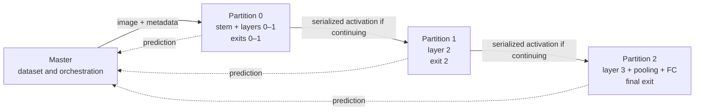

# Coordinated Early-Exit Inference on Resource-Constrained Edge Systems

[](Thesis.pdf)


Experimental artifact for the diploma thesis **[“Coordinated Execution of Multiple Early-Exit Artificial Intelligence Models in Resource-Constrained Edge Environments.”](Thesis.pdf)**

This repository evaluates baseline and early-exit ResNet inference on a Raspberry Pi edge cluster. It studies how adaptive computation, model partitioning, partition placement, communication overhead, utilization, and energy interact. The thesis does **not** propose a new neural architecture or training algorithm; it is an experimental systems study of established early-exit models under single-node, distributed, and concurrent multi-model execution.

## Research context

The central question is: **How should partitioning, placement, and resource-aware execution be coordinated when multiple early-exit inference streams share a constrained edge cluster?**

The work contributes:

- a controlled comparison of baseline and entropy-based early-exit ResNet-18/34 inference;
- a three-partition FastAPI/HTTP runtime for distributed early-exit inference;
- a comparison of a naive shared route with three static memory-aware placements for two logical model instances;
- an analysis on CIFAR-10 and CIFAR-10.1 using accuracy, exit distribution, latency, throughput, application-level utilization, communication/runtime overhead, and software-estimated energy.

The central result is systemic: early exit improves single-node inference, but distributing a model does not automatically make it faster. In multi-model execution, suitable placement improves throughput, utilization, overhead, and energy efficiency; the best placement depends on the input-dependent exit distribution.

## System architecture

The experimental cluster contains four Raspberry Pi 4 Model B devices: one master and three CPU workers, connected through a wired Ethernet LAN.

| Component | Role |
| --- | --- |
| Master | Loads the test set, initiates inference tasks, and records end-to-end results |
| Workers 1–3 | Execute assigned model partitions |
| Runtime | FastAPI/Uvicorn over HTTP |
| Payload | JSON metadata plus a serialized raw input/activation tensor |



This is the canonical Experiment 1.3/2 route. Experiment 3 preserves the split but changes which worker executes each partition for each logical model instance. Adjacent partitions on the same worker execute locally without an HTTP transfer.

### Early-exit mechanism

ResNet-18 and ResNet-34 use block layouts `[2, 2, 2, 2]` and `[3, 4, 6, 3]`. Their early-exit variants add heads after the first three residual stages. Inference terminates at the first head whose softmax entropy satisfies `H(p) <= 0.9`; otherwise it reaches the final classifier. The same checkpoint and threshold are retained across each single-node/distributed comparison.

### Terminology

| Term | Meaning |
| --- | --- |
| **Partitioning** | The fixed three-way split defining what executes together |
| **Placement** | The mapping from `(model instance, partition)` to a worker |
| **Logical model instance** | An independent inference stream using the same architecture and checkpoint |
| **Route** | The ordered worker path of one logical model instance |
| **Experiment 2** | Both instances follow `worker1 → worker2 → worker3` |
| **Experiment 3** | Initial high-traffic partitions are separated and later partitions are remapped |

## Models and datasets

| Item | Use in the final thesis |
| --- | --- |
| ResNet-18/34 baseline | Full-depth single-node reference |
| ResNet-18/34 early exit | Three intermediate heads plus the final classifier |
| CIFAR-10 | Training set and primary 10,000-image test benchmark |
| CIFAR-10.1 v6 | Independent 2,000-image test set; no retraining or threshold change |

Inputs are resized to `256 × 256`, normalized with CIFAR-10 statistics, and evaluated with batch size 1 after 20 warm-up samples. CIFAR-10 downloads through TorchVision. CIFAR-10.1 must be placed on the master at:

```text
data/cifar10.1/cifar10.1_v6_data.npy
data/cifar10.1/cifar10.1_v6_labels.npy
```

## Repository structure

```text
├── checkpoints/             # Four CIFAR-10 checkpoints tracked with Git LFS
├── configs/                 # Dataset, model, system, and experiment YAML
├── docs/                    # Experiment and metrics references
├── results/                 # 28 final runs and thesis plots/tables
├── scripts/                 # Environment and launch helpers
├── src/                     # Models, runtime, metrics, and visualization
└── requirements.txt         # Non-PyTorch dependencies
```

## Installation

Python 3, `venv`, `pip`, and Git LFS are required. Distributed shell helpers also require Bash and `curl`. Dependency versions are not pinned, so `requirements.txt` does not define a bit-for-bit environment.

```bash
git lfs install
git lfs pull
bash scripts/setup_environment.sh --with-torch
source venv/bin/activate
export PYTHONPATH="$PWD"
```

PowerShell equivalent:

```powershell
.\scripts\setup_environment.ps1 -WithTorch
.\venv\Scripts\Activate.ps1
$env:PYTHONPATH = (Get-Location).Path
```

Run setup on the master and every worker. The scripts install [`requirements.txt`](requirements.txt), then CPU PyTorch and TorchVision from the configured PyTorch/Piwheels indexes.

## Configuration

Each experiment YAML composes a dataset, model, and system config. Dataset configs define preprocessing; model configs define architecture, checkpoint, and entropy threshold; system configs define CPU devices, LAN addresses, ports, and canonical order; experiment configs add run identity, warm-up, concurrency/placement, and output path.

Update `connect_host` in [`configs/systems/homogeneous_3workers.yaml`](configs/systems/homogeneous_3workers.yaml) if the LAN addresses differ from the thesis cluster. Keep the same revision and exact experiment config on all nodes.

Output paths are fixed to `run_001`; rerunning a supplied config overwrites that directory. Copy the config and change only `output.dir` to preserve published results.

## Checkpoints and training provenance

The final runs require these Git LFS artifacts on every model-serving node:

```text
checkpoints/resnet18_baseline.pth
checkpoints/resnet34_baseline.pth
checkpoints/resnet18_ee_entropy.pth
checkpoints/resnet34_ee_entropy.pth
```

The checkpoints were trained on CIFAR-10 in a separate Jupyter Notebook and imported into this runtime. That notebook is not included. The utilities under `src/training/` are not a provenance-complete recipe for the four published checkpoints, so exact training is not reproducible from this repository alone; inference reproduction uses the supplied checkpoints as fixed inputs.

## Running Experiments 1–3

Run from the repository root with the environment active. The full catalog and worker lifecycle are in [`docs/experiment_guide.md`](docs/experiment_guide.md).

Single-node Experiment 1.1 and 1.2:

```bash
bash scripts/run/run_exp1_1_baseline_single_node_cifar10.sh
bash scripts/run/run_exp1_2_ee_single_node_cifar10.sh
```

For each distributed config, start the exact same config on the three worker devices:

```bash
CONFIG=configs/experiments/exp1_3_resnet18_ee_3nodes_cifar10.yaml
bash scripts/run/start_worker_api.sh "$CONFIG" worker1  # Worker 1
bash scripts/run/start_worker_api.sh "$CONFIG" worker2  # Worker 2
bash scripts/run/start_worker_api.sh "$CONFIG" worker3  # Worker 3
```

Then on the master:

```bash
bash scripts/run/healthcheck.sh "$CONFIG"
bash scripts/run/run_exp1_3_ee_3nodes_cifar10.sh "$CONFIG"
```

Experiment 2 uses the same worker-start procedure and the naive two-instance route:

```bash
CONFIG=configs/experiments/exp2_resnet18_cifar10.yaml
bash scripts/run/run_exp2_homogeneous_multi_model_cifar10.sh "$CONFIG"
```

Experiment 3 changes the placement. Restart all three workers with the chosen config before running:

```bash
CONFIG=configs/experiments/exp3_2_resnet18_cifar10.yaml
bash scripts/run/run_exp3_memory_aware_multi_model_cifar10.sh "$CONFIG"
```

The health check verifies reachability and base worker/model/dataset identity, but not the full Experiment 3 route. Restart workers for every placement config. Although wrappers accept multiple configs, run one explicit config per worker lifecycle.

### CIFAR-10.1 evaluation

```bash
bash scripts/run/run_exp1_1_baseline_single_node_cifar10_1.sh
bash scripts/run/run_exp1_2_ee_single_node_cifar10_1.sh

# After starting all workers with the matching explicit config:
bash scripts/run/run_exp1_3_ee_3nodes_cifar10_1.sh configs/experiments/exp1_3_resnet18_ee_3nodes_cifar10_1.yaml
bash scripts/run/run_exp2_homogeneous_multi_model_cifar10_1.sh configs/experiments/exp2_resnet18_cifar10_1.yaml
bash scripts/run/run_exp3_memory_aware_multi_model_cifar10_1.sh configs/experiments/exp3_3_resnet18_cifar10_1.yaml
```

## Metrics and generated outputs

Current runs write `metrics.json`, `inference_times.csv`, and `resolved_config.json`. Archived CIFAR-10 runs use `latencies.csv` and `*_latency_sec`; current code/CIFAR-10.1 use `inference_times.csv` and `*_inference_time_sec`. Visualization code accepts both. See [`docs/metrics_definition.md`](docs/metrics_definition.md).

Generate supported tables and plots directly:

```bash
python -m src.visualization.tables --dataset-name cifar10 --table all --best-experiment 3.2
python -m src.visualization.plots --dataset-name cifar10 --plot all --best-experiment 3.2
python -m src.visualization.tables --dataset-name cifar10_1 --table all --best-experiment 3.3
python -m src.visualization.plots --dataset-name cifar10_1 --plot all --best-experiment 3.3
```

Outputs are CSV/LaTeX tables and PNG/PDF figures under `results/thesis_visualizations/`. The older `generate_exp*_thesis_artifacts` wrappers reference a missing `src.visualization.summary` module and are not a working end-to-end interface in this revision.

## Main results

These values are verified in both the final thesis and stored results.

| Model | CIFAR-10 execution | Accuracy (%) | Mean latency (s) | Throughput (tasks/s) |
| --- | --- | ---: | ---: | ---: |
| ResNet-18 | Baseline, single node | 89.74 | 0.4466 | 2.191 |
| ResNet-18 EE | Early exit, single node | 85.32 | 0.2659 | 3.630 |
| ResNet-18 EE | Early exit, three workers | 85.32 | 0.3582 | 2.704 |
| ResNet-34 | Baseline, single node | 88.57 | 0.8637 | 1.145 |
| ResNet-34 EE | Early exit, single node | 86.38 | 0.3906 | 2.490 |
| ResNet-34 EE | Early exit, three workers | 86.38 | 0.4149 | 2.344 |

Early exit substantially improves single-node latency and throughput, with the expected accuracy trade-off. Distributed execution preserves accuracy and exit decisions but is not automatically faster: on CIFAR-10, communication and runtime costs offset the split computation benefit.

| Dataset | Model | Exp2 throughput | Highest-throughput placement | Throughput | Speedup |
| --- | --- | ---: | --- | ---: | ---: |
| CIFAR-10 | ResNet-18 EE | 2.881 | Exp3.3 cross-balanced | 4.745 | 1.647× |
| CIFAR-10 | ResNet-34 EE | 2.468 | Exp3.2 staggered late | 4.529 | 1.835× |
| CIFAR-10.1 | ResNet-18 EE | 2.838 | Exp3.1 first split | 5.262 | 1.854× |
| CIFAR-10.1 | ResNet-34 EE | 2.241 | Exp3.3 cross-balanced | 4.664 | 2.081× |

All Experiment 3 placements improve on the naive route. Exp3.2 is the strongest overall compromise on CIFAR-10; Exp3.3 is the most stable overall choice on CIFAR-10.1, where more samples reach deeper partitions. The best placement therefore depends on the exit distribution.

On CIFAR-10, Exp2 communication/runtime overhead ratios of 58.85%/57.27% for ResNet-18/34 fall to roughly 20–25% in Experiment 3. For the thesis-selected Exp3.2, estimated energy per task falls from 4.64 J to 2.91 J for ResNet-18 EE and from 5.58 J to 3.09 J for ResNet-34 EE. CodeCarbon values are software estimates intended mainly for relative comparison in the same setup, not external power-meter measurements.

## Reproducibility notes and limitations

- Final results comprise 28 runs: 14 on CIFAR-10 and 14 on CIFAR-10.1.
- Multi-model task counts are model–sample pairs, so 10,000 images create 20,000 tasks for two instances.
- Worker utilization is normalized application compute load, not OS CPU utilization, and may exceed 100% under concurrency.
- Communication/runtime overhead is master-observed latency minus reported remote compute, not a packet-level measurement.
- Evaluation uses batch size 1, threshold `0.9`, static placements, one homogeneous four-node cluster, and the CIFAR-10 family.
- Exact dependency versions and the checkpoint-training notebook are unavailable.
- CIFAR-100 loader/config/script paths exist, but their checkpoints and results do not. They are scaffolding, not a thesis result.

Proposed—not implemented—work includes dynamic placement, threshold sweeps, joint split/placement optimization, heterogeneous hardware, monitoring dashboards, tensor compression or lighter RPC, other architectures, and external power measurement.

## Citation

```bibtex
@mastersthesis{polychronopoulos2026coordinated,
  author  = {Ioannis Polychronopoulos},
  title   = {Coordinated Execution of Multiple Early-Exit Artificial
             Intelligence Models in Resource-Constrained Edge Environments},
  school  = {National Technical University of Athens},
  type    = {Diploma thesis},
  address = {Athens, Greece},
  year    = {2026}
}
```

## License

No license file is present. Until the author selects and adds a license, the repository should not be treated as granting permission to copy, modify, or redistribute its contents.

## Author and affiliation

**Ioannis Polychronopoulos**<br>
School of Electrical and Computer Engineering<br>
Information Technology and Computer Engineering Division<br>
National Technical University of Athens
